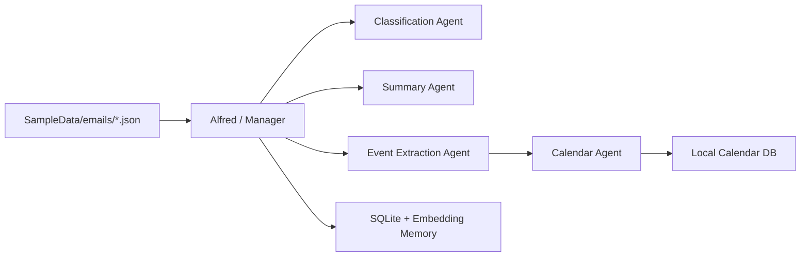

# springAI2026

This app now runs a local-only email organizer in C#.

## What It Does

- Reads sample emails from `SampleData/emails`.
- Uses a manager agent (`Alfred`) to coordinate specialist agents for:
  - classification
  - summarization
  - event extraction
  - calendar validation
- Stores processed emails and summaries in SQLite.
- Uses local embeddings for RAG-style search over processed inbox data.
- Adds validated dates to the local calendar database.
- Exposes the workflow through chat and HTTP endpoints.

## Local Workflow



## Sample Email Format

Drop `.json` files into `SampleData/emails`.

Example:

```json
{
  "id": "email-001",
  "threadId": "thread-001",
  "fromAddress": "professor@example.edu",
  "subject": "Exam reminder",
  "snippet": "Midterm exam next Friday",
  "plainTextBody": "Your midterm exam is on 2026-05-01 at 9:00 AM in Room 204.",
  "labels": ["INBOX"],
  "receivedAtUtc": "2026-04-24T12:00:00Z",
  "isArchived": false
}
```

## Config

`appsettings.json` is local-only now.

- `Chat`
  - OpenAI-compatible local chat endpoint, such as Ollama.
- `Embeddings`
  - OpenAI-compatible local embedding endpoint.
- `LocalMailbox`
  - Directory where sample email files live.
- `EmailProcessing`
  - Default processing behavior.

## Run

```bash
dotnet run --project CARTS.csproj
```

## Endpoints

- `POST /chat`
- `GET /mailbox/status`
- `POST /email/process`
- `GET /emails`
- `GET /emails/search?query=...`
- `POST /emails/{id}/events`
- `GET /events`

## Quality Checks

```bash
dotnet test CARTS.Tests/CARTS.Tests.csproj
dotnet build CARTS.csproj
```
