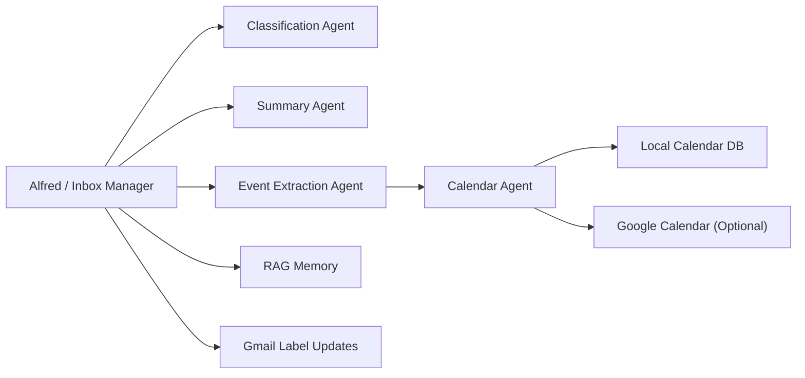

# springAI2026

This project now includes a C# email-organization workflow built as a manager-and-specialists agent system for Gmail.

## What It Does

- Reads recent Gmail messages through Google OAuth.
- Routes each email through specialist agents for:
  - classification
  - summarization
  - event extraction
  - calendar validation
- Applies Gmail-style organization labels:
  - `IMPORTANT`
  - `CATEGORY_PROMOTIONS`
  - `SPAM`
- Stores processed email summaries and embeddings in SQLite for lightweight RAG search.
- Adds validated dates to the local calendar database.
- Optionally pushes validated events into Google Calendar.
- Exposes the inbox workflow as HTTP endpoints and as MCP tools.

## Agent Workflow



## Main Components

- `Program.cs`
  - Registers chat, embeddings, Gmail services, MCP, and HTTP endpoints.
- `backend/Services/EmailManagerAgentService.cs`
  - Manager agent orchestration for inbox processing.
- `backend/Services/EmailSpecialistAgents.cs`
  - Classification, summary, event extraction, and calendar validation specialists.
- `backend/Services/GmailMailboxService.cs`
  - Gmail read/label write plus optional Google Calendar event creation.
- `backend/Services/EmailMemoryService.cs`
  - Embedding generation and similarity search for processed email memory.
- `backend/Mcp/EmailMcpTools.cs`
  - MCP tools for inbox sync, search, and Gmail status.

## Setup

### 1. Create a Google Cloud OAuth desktop client

Enable these APIs in Google Cloud:

- Gmail API
- Google Calendar API

Create a desktop OAuth client and download the JSON file.

Place that file here:

- `secrets/google-oauth-client.json`

### 2. Configure model endpoints

The default config assumes OpenAI-compatible local endpoints:

- chat: `http://localhost:11434/v1`
- embeddings: `http://localhost:11434/v1`

Update `appsettings.json` if you want to use another provider.

### 3. Optional Google Calendar sync

If you want extracted events pushed into Google Calendar, set:

```json
"Google": {
  "EnableGoogleCalendarWrite": true
}
```

### 4. Run the app

```bash
dotnet run --project CARTS.csproj
```

The app listens on `http://localhost:5000`.

## Endpoints

- `GET /gmail/status`
  - Checks whether the Google OAuth credentials file exists and whether an account is authenticated.
- `POST /email/process`
  - Syncs recent Gmail messages and runs the full agent workflow.
- `GET /emails`
  - Lists processed emails from SQLite.
- `GET /emails/{id}`
  - Shows one processed email plus extracted calendar suggestions.
- `GET /emails/search?query=...`
  - Runs RAG search across processed email memory.
- `POST /emails/{id}/events?googleCalendar=true|false`
  - Pushes saved suggestions from one processed email into the calendar.
- `GET /events`
  - Lists local calendar entries.
- `POST /chat`
  - Alfred can use the inbox tools from chat as well.
- `POST /mcp`
  - MCP endpoint for external MCP clients.

## Example Inbox Sync Request

```bash
curl -X POST http://localhost:5000/email/process \
  -H "Content-Type: application/json" \
  -d '{
    "maxResults": 10,
    "query": "in:inbox newer_than:14d",
    "applyGmailLabels": true,
    "addEventsToLocalCalendar": true,
    "addEventsToGoogleCalendar": false
  }'
```

## Example Alfred Prompts

- `Sync my latest 10 emails and organize them.`
- `Search my organized emails for exam dates.`
- `Summarize the important messages from this week.`
- `Check whether Gmail is connected correctly.`

## MCP Tools

The app publishes these MCP tools:

- `SyncInbox`
- `SearchEmails`
- `GmailStatus`

This lets other MCP-capable clients call your inbox manager directly.
